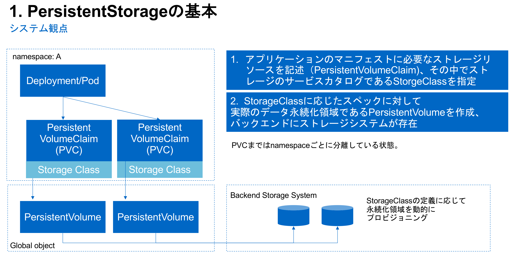

## 2．Kubernetesのストレージについて

ここではKubernetesにおけるデータを保管するコンポーネントについて記載します。

データを保管するもの、データを保管する領域を作成する方法やサービスカタログ化するkubernetesのストレージの章となります。

### 1．PersistentStorageの基本（渡邊）

Kubernetesではストレージに関するコンポーネントは３つあります。

- StorageClass
  - サービスカタログを定義するもの。
- PersistentVolumeClaim
  - アプリケーションが必要なストレージリソースを定義するオブジェクト、ここで前述のStorageClassを指定しアプリケーションに適したストレージをプロビジョニングする。
- PersistentVolume
  - 実際にデータを保管する場所を定義しているオブジェクト

それぞれの関係を図示し、ここにnamespaceの概念を加えるたものは以下の図になります。

### 2．DynamicProvisioningとは（渡邊）

コンテナにおいてデータ永続化を実現する上でストレージは重要なコンポーネントになります。

Dynamic volume provisiong はオンデマンドにストレージをプロビジョニングするためのものです。

Static provisioning、Dynamic provisioning それぞれを比較します。

Static provisioningの場合、クラスタの管理者がストレージをプロビジョニングして、PersitentVolumeオブジェクトを作成しkubernetesに公開する必要があります。

Dynamic provisioningの場合、Static provisioningで手動で行っていたステップを自動化し、管理者がおこなっていたストレージの事前のプロビジョニング作業をなくすことができます。

StorageClassオブジェクトで指定したプロビジョナを使用し、動的にストレージリソースをプロビジョニングすることができます。

StorageClassには様々なパラメータを指定することができアプリケーションに適したストレージカタログ、プロファイルを作成することができ、物理的なストレージを抽象化するレイヤとなります。

ネットアップはDynamic provisioningを実現するためのNetApp Tridentというprovisionerを提供しています。

### 3．StorageClassの基本（渡邊）

StoageClassはストレージ管理者へストレージの **クラス** を定義する方法を提供します。
クラスごとにサービスの内容をマッピングします、設定できる属性としては、性能におけるポリシー、データ保護に関連するポリシー、その他のポリシーをkubernetesクラスタの管理者が設定できます。

ストレージクラスはAWSやAzureなどのサービスカタログを定義するものと考えるとわかりやすいかと思います。たとえば 汎用用途のGP2、性能特価型のProvisioned IOPS、容量効率に特価した sc1といったようなものです。

このコンセプト自体はストレージシステムではプロファイルと呼ばれることもあります。

- https://kubernetes.io/docs/concepts/storage/storage-classes/ 

