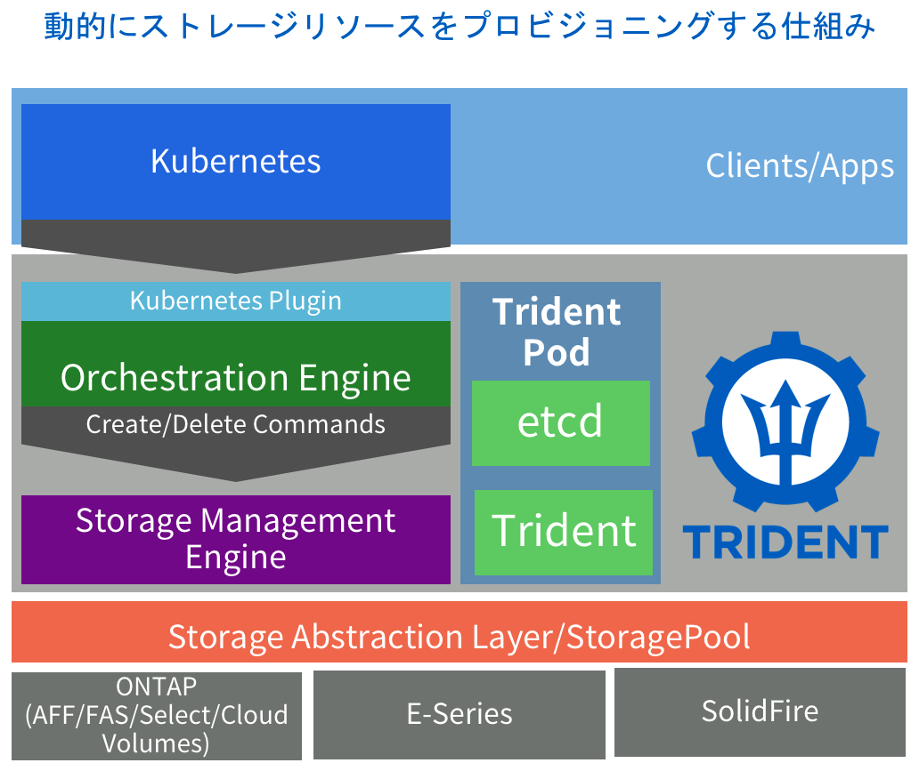

## 3．Tridentのコンポーネント・構築/構成

NetAppが提供している **Trident** はOSSとしてGitHubで公開しています。
オンプレミスでクラウド同等のダイナミックプロビジョニングの仕組みを提供し、特徴的なストレージ機能が使用可能なものです。

- https://github.io/netapp/trident

### 1．Tridentの概要（渡邊）

Dynamic storage provisioningを実現するためのNetApp Tridentを紹介します。 TridentはPodとしてデプロイされ通常のアプリケーションと同様に稼働します。



### 2．ホストOS設定(iscsi、nfsクライアントのインストール)（渡邊）

TridentのバックエンドにはNFS,iSCSIが利用可能です。
外部ストレージをホストにマウントするため、すべてのkubernetes クラスタに存在するノードに設定します。

RHEL、CentOSついては以下のURLを確認ください。

[Worker preparation](https://netapp-trident.readthedocs.io/en/stable-v18.07/kubernetes/operations/tasks/worker.html)

参考までに最近のCoreOSは以下のNFS, iSCSIのパッケージがデフォルトでインストールされています。

#### NFS

``` console

sudo apt-get install -y nfs-common

```

#### iSCSI

パッケージの導入

``` console

sudo apt-get install -y open-iscsi lsscsi sg3-utils multipath-tools scsitools

```

マルチパスの有効化

``` console

$ sudo tee /etc/multipath.conf <<-'EOF'
defaults {
    user_friendly_names yes
    find_multipaths yes
}
EOF

$ sudo systemctl enable multipath-tools.service
$ sudo service multipath-tools restart

```

open-iscsiとmultipath-toolsを有効化し、起動設定とする。

``` console

sudo systemctl status multipath-tools
sudo systemctl enable open-iscsi.service
sudo service open-iscsi start
sudo systemctl status open-iscsi

```

### 3．バックエンドストレージ設定（渡邊）

#### ONTAP の設定

ONTAPの事前準備は以下の通りです。

- SVM作成・設定
- LIF作成・設定
- export policy の作成・設定
- 使用するプロトコルのサービス有効化

以下の一連のコマンドラインを実行するとTridentからバックエンド設定する準備が整います。

``` console
vserver create -vserver [SVM名] -ipspace [IPSpace名] -aggregate [アグリゲート] -language C.UTF-8 -rootvolume root -rootvolume-security-style unix

nfs create -vserver [SVM名] -access true -v3 enabled -v4.0 enabled -tcp enabled

export-policy rule create -vserver [SVM名] -policyname default -clientmatch 0.0.0.0/0 -rorule any -rwrule any  -superuser any

network interface create -vserver [SVM名] -lif [データLIF名] -role data -data-protocol nfs -home-node [ホームノード名] -home-port [ホームポート] -subnet-name [サブネット名] -status-admin up -failover-policy system-defined -firewall-policy data -auto-revert true

network interface create -vserver [SVM名] -lif [管理LIF名] -role data -data-protocol none -home-node [ホームノード名] -home-port [ホームポート] -subnet-name [サブネット名] -status-admin up -failover-policy system-defined -firewall-policy mgmt -auto-revert true

security login password -username vsadmin -vserver [SVM名]

security login unlock -vserver [SVM名] -username vsadmin

vserver modify -vserver [SVM名] -aggr-list [アグリゲート名(vsadminで変更可能なaggregateを定義)]
```

#### SolidFire の設定

SolidFireについては事前準備は今回の構成不要です。
定義ファイルに定義したユーザなどはなければ自動で作成します。

### 4．Tridentのインストール（渡邊）

Trident のインストールでk8sクラスタの管理者権限が必要になります。

``` console

kubectl auth can-i '*' '*' --all-namespaces

```

バックエンドに登録するマネジメントIPにk8sクラスタのコンテナから疎通が取れるかを確認します。

``` console

kubectl run -i --tty ping --image=busybox --restart=Never --rm --  ping [ipアドレス]

```

バイナリをダウンロードしてインストールします。 バックエンドストレージのための ``setup/backend.json`` を編集します。以下はサンプルとなります。

``` console

wget https://github.com/NetApp/trident/releases/download/v18.01.0/trident-installer-18.01.0.tar.gz
tar xzf trident*.tar.gz && cd trident-installer
cp sample-input/backend-ontap-nas.json setup/backend.json

```

tridentのインストールや管理を簡易化するユーティリティのtridentctlが同一フォルダに存在します。
今後のオペレーションはtridentctlを使用しておこないます。

#### Tridentの構成

TridentではTrident自体の設定(登録されているバックエンドストレージなど)を保管する必要があります。
そのためインストールの時点で前節でコピーした ``setup/backend.json``で構成情報を保管するボリュームを作成し、
Tridentのインストールプロセスでデータが保管されます。

今回は準備したONTAPをTrident構成情報のデータ永続化先とします。
以下の構成ファイルを使用して

```json backend.json

{
    "version": 1,
    "storageDriverName": "ontap-nas",
    "managementLIF": "SVM管理IP",
    "dataLIF": "データ通信用のIP",
    "svm": "SVM名",
    "username": "vsadmin",
    "password": "パスワード"
}

```

tridentctl

``` console

tridentctl -n trident create backend -f setup/backend.json

```

#### NFSバックエンドの場合(ONTAPバックエンド)

``setup``ディレクトリに``ontap-nas-backend.json``を作成します。
修正する箇所は主に接続するIPとユーザ、パスワードです。

``setup/backend.json``を以下のように変更します。

```json ontap-nas-backend.json

{
    "version": 1,
    "storageDriverName": "ontap-nas",
    "managementLIF": "SVM管理IP",
    "dataLIF": "データ通信用のIP",
    "svm": "SVM名",
    "username": "vsadmin",
    "password": "パスワード"
}

```

backend.jsonのを編集後、以下のコマンドを実行しストレージバックエンド登録を行います。

``` console

tridentctl -n trident create backend -f setup/backend.json

```

#### iSCSIバックエンドの場合(SolidFireバックエンド)

Tridentでは複数のストレージバックエンドを登録可能です。
NFSバックエンドと同様にiSCSIバックエンドとしてSolidFireを登録します。

```json solidfire.json

{
    "version": 1,
    "storageDriverName": "solidfire-san",
    "Endpoint": "https://[ユーザ名]:[パスワード]@[MVIPのアドレス]/json-rpc/8.0",
    "SVIP": "192.168.0.240:3260", # SVIPのIPを指定
    "TenantName": "テナント名",
    "InitiatorIFace": "default",
    "UseCHAP": true,
    "Types": [
        {
            "Type": "Bronze",
            "Qos": {
                "minIOPS": 1000,
                "maxIOPS": 2000,
                "burstIOPS": 4000
            }
        },
        {
            "Type": "Silver",
            "Qos": {
                "minIOPS": 4000,
                "maxIOPS": 6000,
                "burstIOPS": 8000
            }
        },
        {
            "Type": "Gold",
            "Qos": {
                "minIOPS": 6000,
                "maxIOPS": 8000,
                "burstIOPS": 10000
            }
        }
    ]
}

```

NFSバックエンド登録時との大きな違いはストレージのサービスレベルを定義しています。最小、最大、バーストの性能値をそれぞれ指定することでStorageClassで性能値を指定された場合に自動でボリュームにQoSを設定することが可能となります。

### StorageClassの定義例

前述のバックエンドごとにStorageClassを作成します。

NFSバックエンドのONTAP用のストレージクラスを定義します。
以下のマニフェストがONTAP用のサンプルとなります。

```parameters```で性能面におけるサービスとプロビジョニング時のボリュームオプション、データ保護について指定しています。これらの組み合わせでサービスカタログを作成します。

- 指定可能なオプション: URL を記載

```yaml ontap-nas.json
apiVersion: storage.k8s.io/v1
kind: StorageClass
metadata:
  name: ontap-gold
provisioner: netapp.io/trident
parameters:
  backendType: "ontap-nas"
  media: "ssd"
  provisioningType: "thin"
  snapshots: "true"
```

```tridentctl```ユーティリティを使用してバックエンド登録実施。

``` console

$  ./tridentctl -n trident create backend -f setup/backend.json

+-------+----------------+--------+---------+
| NAME  | STORAGE DRIVER | ONLINE | VOLUMES |
+-------+----------------+--------+---------+
| svm12 | ontap-nas      | true   |       0 |
+-------+----------------+--------+---------+

```

同様にSolidFireのバックエンドを登録。

こちらのサービスカタログでは期待するIOPS値とブロックストレージをフォーマットするファイルシステムを指定しています。

```yaml solidfire-extreme.json

apiVersion: storage.k8s.io/v1
kind: StorageClass
metadata:
  name: solidfire-gold
provisioner: netapp.io/trident
parameters:
  backendType: "solidfire-san"
  IOPS: "8000"
  fsType: "ext4"

```

以下のコマンドでストレージクラスを作成


```console

$ ./tridentctl -n trident create backend -f setup/solidfire.json

+-------------------------+----------------+--------+---------+
|          NAME           | STORAGE DRIVER | ONLINE | VOLUMES |
+-------------------------+----------------+--------+---------+
| solidfire_192.168.0.240 | solidfire-san  | true   |       0 |
+-------------------------+----------------+--------+---------+

```

これまでに作成したストレージクラスを確認します。

``` console

$ kubectl get sc

NAME             PROVISIONER         AGE
ontap-gold       netapp.io/trident   2m
solidfire-gold   netapp.io/trident   21s

```

`ontap-gold`ストレージクラスをデフォルトのストレージクラスに変更します。
デフォルトのストレージクラスに設定するとPVCにストレージクラスを設定せずともDynamic Provisioingで使用されるストレージクラスが設定され利便性が向上します。

``` console

$ kubectl patch storageclass ontap-gold -p '{"metadata": {"annotations":{"storageclass.kubernetes.io/is-default-class":"true"}}}'

storageclass.storage.k8s.io/ontap-gold patched

$ kubectl get sc

NAME                   PROVISIONER         AGE
ontap-gold (default)   netapp.io/trident   5m
solidfire-gold         netapp.io/trident   3m

```
